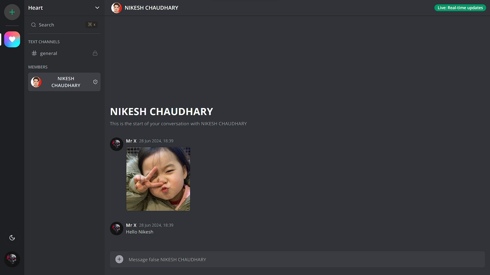

# Server-rooms - Your Ultimate Communication Hub

Server-Rooms is a dynamic and feature-rich web application designed to provide a seamless communication experience, akin to popular platforms like Discord. Whether you're looking to connect with friends, organize community events, or collaborate on projects, Server-Rooms offers everything you need for effective and enjoyable interactions.

## 🔮 Server-Rooms Features

-   🔐 **Secure Authentication:** Seamless and secure user authentication powered by Clerk for a safe user experience.
-   💬 **Real-Time Chatting:** Instant messaging with real-time updates using Socket.io, ensuring smooth and continuous communication.
-   📁 **File Upload:** Easily upload and share files within channels using UploadThing for efficient collaboration.
-   🏠 **Server and Channel Creation:** Create and manage multiple servers and channels to organize your communities and discussions.
-   📞 **Audio and Video Calls:** Integrated audio and video calling features for enhanced communication and collaboration.
-   🔄 **Continuous Updates:** Ensure your conversations and activities are always up-to-date with real-time updates and notifications.
-   📱 **Responsive Design:** Access the application seamlessly on any device with a responsive and user-friendly interface.
-   🎨 **Customizable Themes:** Switch between light and dark modes for a personalized user experience.
-   🛠️ **User Profiles and Avatars:** Personalized user profiles with custom avatars powered by Radix UI.
-   🔍 **Advanced Search:** Quickly find users, channels, and messages with an advanced search functionality.
-   🎉 **Rich Text and Emojis:** Enhance your messages with rich text formatting and a wide range of emojis from Emoji Mart.
